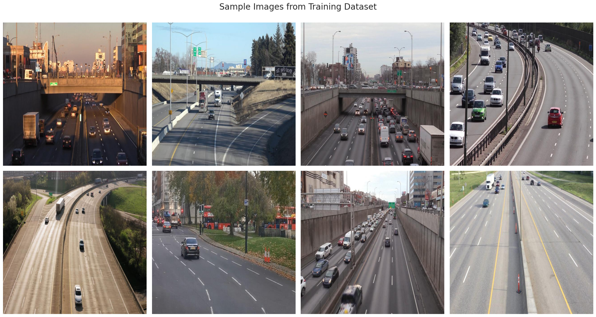
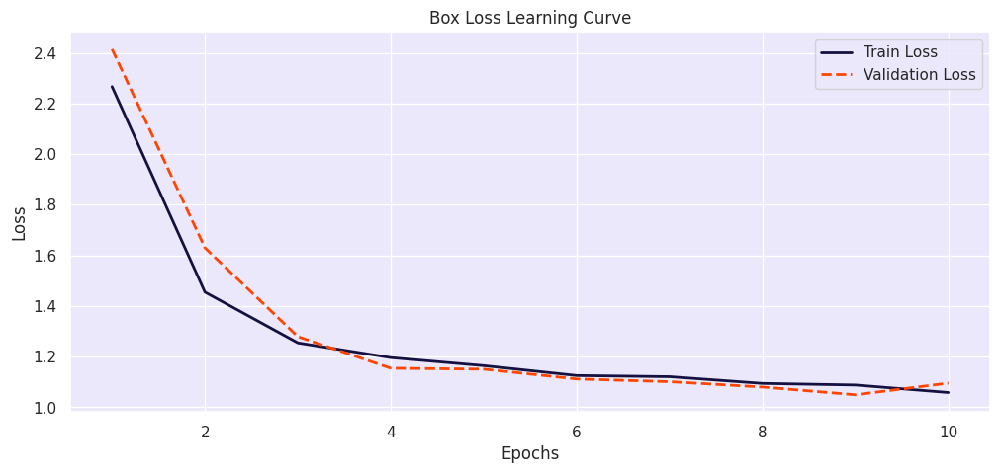
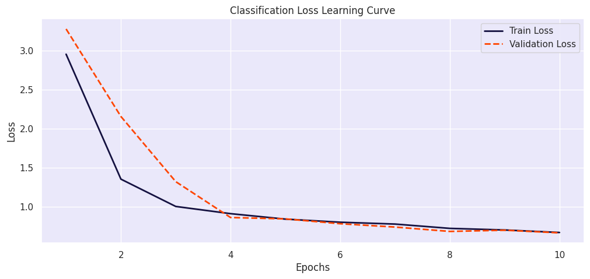
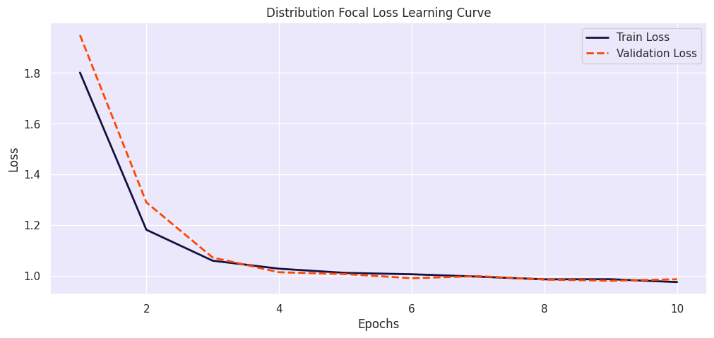

# Yolo-V8-Real-Time-Car-Object-Detection

https://github.com/JessiYang0/Yolo-V8-Real-Time-Car-Object-Detection/assets/63945492/8c9c6977-0fb3-413d-8498-92d36aa661f0

The goal is to count vehicles within a specific area in each frame to assess traffic density. This valuable data aids in identifying peak traffic periods, congested zones, and assists in urban planning. 

## Dataset
Training: 536 images
Validation: 90 images
Label: Contains YOLOv8 format labels 
standard input size of 640x640 pixels

## Setup
* Load a pretrained YOLOv8n model from Ultralytics
* The pre-trained model we've loaded is trained on the COCO dataset, which includes the 'car' and 'truck' classes among its 80 different categories — exactly what we need for our project

## Training result
This trend, along with the close alignment of training and validation loss lines, suggests that the model is learning effectively without overfitting, meaning it is well-tuned to the dataset without being biased or too variable.

## Inference on Validation Set Images
 

## Inference on an Unseen Test Video
Demonstrate the model's ability to adapt and perform accurately in real-world applications, further solidifying its effectiveness outside of the controlled dataset environment.

## Model Export for Cross-Platform Deployment
we'll be exporting it in the ONNX (Open Neural Network Exchange) format. ONNX is specially designed for model portability, enabling seamless operation across different machine learning frameworks including PyTorch, TensorFlow, and Microsoft's Cognitive Toolkit (CNTK)
